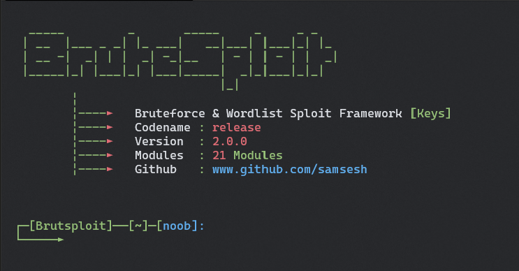

# Brutesploit

[]()
[]()
[]()
[]()

BruteSploit is a collection of method for automated Generate, Bruteforce and Manipulation wordlist with interactive shell.
That can be used during a penetration test to enumerate and can be used in CTF for manipulation,combine,transform and permutation some words or file text :p i wrote this just for fun and learn how create interactive shell  is work


</img> 


### Donate
- If this project very help you to penetration testing  and u want support me , you can give me a cup of coffee :)
- [](https://idpay.ir/sudoinit0)


### Features & Tutorial [ Request submit a new issue ]
- https://www.youtube.com/watch?v=x51As2OS2z4 
- Channel : https://www.youtube.yellowlight.ir

Check in this video : 

## :scroll: Changelog
Be sure to check out the [Changelog] and Read CHANGELOG.md


## Getting Started
1. ```git clone https://github.com/samsesh/Brutesploit.git```
2. ```cd Brutesploit```
3. ```chmod +x install.sh ```
3. ```sudo ./install.sh or sudo su ./install.sh ```
4. ```sudo ./Brutesploit ```
 

## A linux operating system. We recommend :
- Kali Linux
- Cyborg
- Parrot 
- BackTrack 
- Backbox  
- windows wsl v2 (you need xlaunch)

## BUG ? 
- Please Submit new issue 

## Donations 

- Donation: Send to [idpay](https://idpay.ir/sudoinit0)

